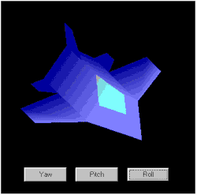



## \_a cool 3D jet simulation

### Description

Real Time 3D Jet Simulation with Gouraud Shading and Ambient Lighting. PLS. REGISTER THE VBOPENGL.TLB type library before running the program.
 
### More Info
 

             |
---                |---
**Submitted On**   |2000-08-04 08:05:36
**By**             |[martin castañeda](https://github.com/Planet-Source-Code/PSCIndex/blob/master/ByAuthor/martin-casta-eda.md)
**Level**          |Advanced
**User Rating**    |4.7 (117 globes from 25 users)
**Compatibility**  |VB 5\.0, VB 6\.0
**Category**       |[Graphics](https://github.com/Planet-Source-Code/PSCIndex/blob/master/ByCategory/graphics__1-46.md)
**World**          |[Visual Basic](https://github.com/Planet-Source-Code/PSCIndex/blob/master/ByWorld/visual-basic.md)
**Archive File**   |[CODE\_UPLOAD8581832000\.zip](https://github.com/Planet-Source-Code/martin-casta-eda-a-cool-3d-jet-simulation__1-10374/archive/master.zip)

